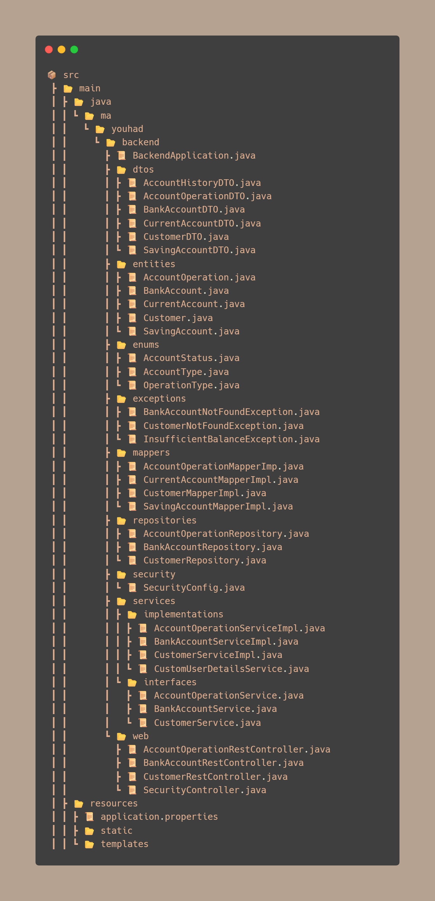
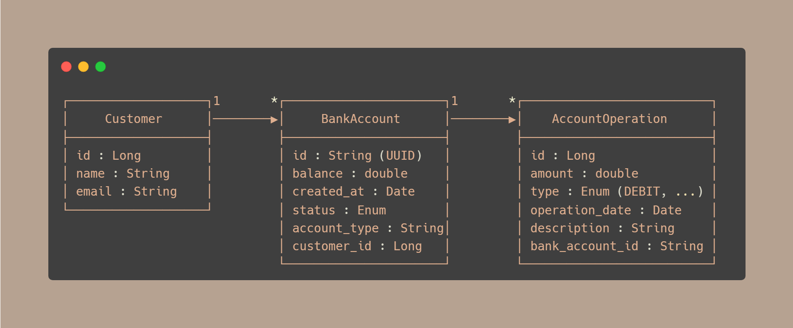

# 💳 E-BANK Backend Application

A robust and modular backend banking system built with **Spring Boot**, **Spring Data JPA**, and **MariaDB/MySQL**.

This backend powers core banking features such as customer management, bank account operations (debit, credit, transfer), and full transaction history. The application is structured with clean architectural separation (DTOs, services, mappers, exception handling) and JWT-based security.

> ⚠️ This repository contains the **backend only**. The **Angular frontend** is implemented in this  [repository](https://github.com/YOUHAD08/e-bank-frontend-angular.git).

---

## 🚀 Features

### ✅ Customer Management

- Create, update, retrieve, and delete customers. 
- Search customers by keyword or exact name.

### ✅ Bank Account Management

- Supports Current Accounts (with overdraft) and Saving Accounts (with interest rate). 
- Create, update, delete, and retrieve bank accounts. 
- Retrieve accounts by customer.

### ✅ Account Operations

- Debit, credit, and transfer between accounts. 
- Track full transaction history with pagination and summaries.

### ✅ Advanced History API
- Structured account history using `AccountHistoryDTO`.
- Access latest operation summaries.

### ✅ Security & Authentication

-JWT-based authentication with role-based access control (USER and ADMIN scopes). 
Password encryption using BCrypt.

### ✅ Exception Handling
Handles common banking errors:
- `CustomerNotFoundException`
- `BankAccountNotFoundException`
- `InsufficientBalanceException`

### ✅ API Documentation

Interactive Swagger UI at:

  http://localhost:8085/swagger-ui/index.html
  
---

## 📂 Project Structure



- **Entities:** `Customer`, `BankAccount`, `CurrentAccount`, `SavingAccount`, `AccountOperation`
- **DTOs:** Transfer objects for API communication
- **Repositories:** Spring Data JPA Repositories
- **Services:** Business logic with interfaces and implementations
- **Controllers:** REST API endpoints secured by JWT scopes
- **Mappers:** Entity ↔ DTO transformation
- **Exceptions:** Custom exceptions for domain errors
- **Security**: JWT generation and validation, password encoding

---

## 🧩 MySQL Database Structure

This backend currently uses a **relational MySQL** database to persist customer, account, and transaction data.



### 🔗 Relationships

- **1️⃣ Customer ⇨ N BankAccounts**
- **1️⃣ BankAccount ⇨ N AccountOperations**

---

## 🛠️ Technologies Used

| Technology        | Version           |
|-------------------|-------------------|
| Java              | 21                |
| Spring Boot       | 3.5.3             |
| Spring Data JPA   | Included          |
| MySQL             | 8+                |
| Lombok            | 1.18.34           |
| Swagger / OpenAPI | 2.5.0             |
| Maven             | Build Tool        |
| H2 (optional)     | For testing       |
| JWT (Nimbus JOSE) | included          |
| BCrypt            | Password Encoding |


---

## 💻 Getting Started

### Prerequisites

- Java 21+
- Maven
- MySQL running (DB name: `E-BANK`)
- (Optional) phpMyAdmin or MySQL client

---

### ⚙️ Setup & Run

1. Clone this repository:
   ```bash
   git clone https://github.com/YOUHAD08/e-bank-backend-springboot.git
   cd e-bank-backend-springboot


2. Configure database in `src/main/resources/application.properties`:
   ```bash
   spring.datasource.url=jdbc:mysql://localhost:3306/E-BANK?createDatabaseIfNotExist=true
   spring.datasource.username=root
   spring.datasource.password=

3.  Build & Run
    ```bash
     mvn clean install
     mvn spring-boot:run

4. Access the APIs:

- Swagger UI: http://localhost:8085/swagger-ui/index.html
- MySQL Database via phpMyAdmin: http://localhost/phpmyadmin/index.php?route=/database/structure&db=e-bank

---

## 📄 API Overview

### Customer API (`/auth`)

- `POST /auth/login` — Login with username and password, returns JWT token. 
- `POST /auth/signup` — Register a new customer (role USER by default). 
- `GET /auth/profile` — Get current authenticated user details.

### Customer API (`/customer, /customers`)

- `GET /customers` — List all customers.
- `GET /customer/{id}` — Get customer by ID.
- `GET /customers/search?keyword=` — Search customers by keyword.
- `GET /customer/search?name=` — Search customer by exact name.
- `POST /customer` — Create customer (ADMIN only).
- `PUT /customer/{id}` — Update customer (ADMIN only).
- `DELETE /customer/{id}` — Delete customer (ADMIN only)

### Bank Account API (`/account`, `/accounts`, `/currentAccount`, `/savingAccount`)

- `GET /account/{accountId}`— Get bank account by ID. 
- `GET /accounts` — List all accounts. 
- `GET /accounts/{customerId}` — List all accounts of a customer. 
- `POST /currentAccount/{customerId}` — Create current account (ADMIN only). 
- `POST /savingAccount/{customerId}` — Create saving account (ADMIN only). 
- `PUT /currentAccount/{accountId}` — Update current account (ADMIN only). 
- `PUT /savingAccount/{accountId}` — Update saving account (ADMIN only). 
- `DELETE /account/{accountId}` — Delete account (ADMIN only).

### Account Operations API (`/account/{accountId}/operations`)

- `GET /account/{accountId}/operations` — List all operations for an account. 
- `GET /account/{accountId}/pageOperations?page=&size=` — Paginated operations list. 
- `POST /account/{accountId}/debit?amount=&description=` — Debit an account. 
- `POST /account/{accountId}/credit?amount=&description=` — Credit an account (ADMIN only). 
- `POST /account/{accountId}/transfer?toAccountId=&amount=` — Transfer money (ADMIN only). 
- `GET /operations` — List all account operations.

---

## 📚 Exception Handling

- `CustomerNotFoundException` - Thrown when a customer is not found. 
- `BankAccountNotFoundException` - Thrown when a bank account is not found. 
- `InsufficientBalanceException` - Thrown when an account has insufficient funds for a debit or transfer.

---

## 🧪 Database Initialization

On startup, the application seeds the database with:

- 10 customers with realistic names, cities, and emails. 
- 3 to 5 random accounts per customer (mix of current and saving). 
- 10 to 20 random debit and credit operations per account.

---

## 🤝 Contribution

Contributions are welcome! Feel free to open issues or pull requests so we grow together.

---

## 🖥️ Next Steps: Agentic AI & Future Database Migration

This project currently implements the **backend RESTful API** using **Spring Boot** and a relational **MySQL** database.

### 🔜 Upcoming Plans

#### 🛠️ Frontend (Done):

The frontend is currently under development using Angular and is structured to provide a clean and interactive UI for:

- Customer and account management 
- Performing debit/credit/transfer operations 
- Viewing paginated account operation history
- ... and more features to come


#### 🤖 Agentic AI Integration (In Progress):
In future development, I plan to build an **agentic AI component** to work alongside this backend. While the full scope is yet to be defined, potential features might include:

- Intelligent customer support and chatbot integration
- Automated transaction analysis and fraud detection
- Personalized financial advice and account management
- Dynamic task automation within the banking system

This agentic AI will aim to enhance user experience, improve operational efficiency, and provide smart automation capabilities.

#### 🔁 Future Migration to MongoDB:
Although this version uses **MySQL**, a future version of this backend will be migrated to **MongoDB** to take advantage of:

- Flexible document-based schema
- Easier scalability
- Faster iterations in development

Stay tuned for the **agentic AI enhancements**, and the **MongoDB-backed backend**!

---

> Developed by **Youhad**  
> © 2025

